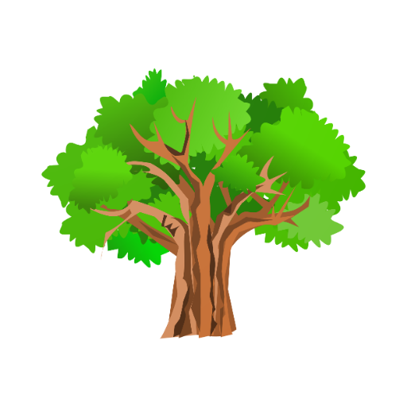

> If you only want to download a program, then jump directly to the [downloads](#downloads) section and click on a file for your platform. If you are looking for instructions to use the visualization program, go to the section [barnatrees](#barnatrees).

This repository contains code to produce two related programs:

- **treedbcreator**. This command line program downloads and parses two complementary XML datasets from the Open Data BCN catalog: Zone trees of the city of Barcelona and Street trees of the city of Barcelona, containing the names of the species and geolocation of the trees of the city of Barcelona located on public roads. The information contains, among other data, the scientific name, the common names and the addresses. The trees of the parks are not included. This data is used to create a relational SQLite database used by the next program.

- **barnatrees**. This graphic program is a data visualization and navigation tool using the database created by the other program over a map of the city of Barcelona.

Both programs use the [Qt framework](https://www.qt.io/), C++ and QML languages, and can be built (using a suitable modern compiler) for the most common targets: Windows, macOS, Linux and Android operating systems.

<a name="downloads"/>
## downloads

The current release is: **Alfa2**

 

 Platform | arch  | files    
:---------|:-----:|:----------
 android  | arm64 | [apk](https://github.com/pedrolcl/barcelona-trees/releases/download/alfa2/barnatrees-alfa2-android-arm64.apk) 
 android  | armV7 | [apk](https://github.com/pedrolcl/barcelona-trees/releases/download/alfa2/barnatrees-alfa2-android-armv7.apk)      
 macOS    | x64   | [dmg](https://github.com/pedrolcl/barcelona-trees/releases/download/alfa2/barnatrees-alfa2-mac-x64.dmg)
 linux    | x64   | [AppImage](https://github.com/pedrolcl/barcelona-trees/releases/download/alfa2/barnatrees-alfa2-linux-x64.AppImage)
 windows  | x64   | [msi](https://github.com/pedrolcl/barcelona-trees/releases/download/alfa2/barnatrees-alfa2-windows-x64.msi)
 sources  | all   | [zip](https://github.com/pedrolcl/barcelona-trees/archive/alfa2.zip)
 sources  | all   | [tar.gz](https://github.com/pedrolcl/barcelona-trees/archive/alfa2.tar.gz)

## treedbcreator

The program does not have any command line arguments. It simply outputs at the same working directory the files &quot;arbrat_viari.xml&quot;, &quot;arbrat_zona.xml&quot; and &quot;barnatrees.db&quot;.

<a name="barnatrees"/>
## barnatrees

Upon startup, this program shows a map of Barcelona, centered at the default location point: Glòries square, a blue circle labeled as &quot;Current Location&quot;, and the trees found nearby. The user can change the location by hand, with a long press and hold of the main mouse button or touch screen, or automatically using the device's GPS (menu option &quot;Update Position&quot;. The user can change the zoom scale either with the mouse wheel or using a &quot;pinch&quot; gesture in the touch screen.

Over the map, each tree is represented as a green circle. When using the maximum zoom and hovering the mouse pointer over each circle the program pops a label with the scientific name. Clicking with the mouse main button, or touching on a touch screen, the program pops a dialog with detailed information about the specimen, including a link to a Wiki page for extended information about the species, and a link to the street view of the address.

Searching functions. The user may search the trees that will be represented in the map, using the following criteria.

- By street (full or partial name) typing in an input area.
- By gender (full or partial name) typing in an input area.
- By scientific name, choosing one from a drop down list containing all the species in the database. The dialog also shows the number of available trees of the chosen species.
- By location: changed by hand or GPS, will represent the trees found in a square of 250 meters side centered at the current location.

In addition to the map representation, the list of trees found by any of the search functions can also be seen as a list (menu option &quot;View Results List&quot;). Each element of the list contains a correlative number, the scientific and common names, the address and the distance to the current location. Pressing with the mouse or touching the screen on one element of the list, that element is selected and highlighted, and also labeled on the map that will be centered on the selected tree.

Configuration settings. The user may change some visualization options using the menu option: &quot;Settings&quot;.

- Style: by default the program uses the &quot;Material&quot; style that is the norm on Android OS. There are several other styles that the user may prefer instead.
- Language: the program is currently translated to English, Catalan and Spanish languages.
- Wiki: when a single tree is selected in the map, the program opens a popup box with the scientific name pointing to a web link. This option allows the user to choose among the following destinations for this link:
  - Wikipedia: [in English, Catalan and Spanish](https://www.wikipedia.org/)
  - Species: [Wikispecies](https://species.wikimedia.org/wiki/Main_Page)
  - Commons: [Wikimedia Commons](https://commons.wikimedia.org/wiki/)

## acknowledgment

The first inspiration to make this program was the work of Juanjo Vidal [Arbrat viari de la ciutat de Barcelona](https://jjvidalmac.carto.com/viz/c3c54164-7fcf-11e4-b04f-0e853d047bba/public_map) using one the datasets from Open Data BCN.
  
## credits

Copyright © 2019 Pedro López-Cabanillas. These program come with ABSOLUTELY NO WARRANTY. This is free software, and you are welcome to redistribute it under the terms of the [GPLv3](https://www.gnu.org/licenses/gpl-3.0.html) license.

This application contains data provided by the Barcelona's city council: [Open Data BCN](https://opendata-ajuntament.barcelona.cat/en/) using the datasets **Zone trees of the city of Barcelona** and **Street trees of the city of Barcelona**  under the therms of the Creative Commons Attribution 4.0 International [(CC BY 4.0)](https://creativecommons.org/licenses/by/4.0/) license.

Map tilesets © [WikiMedia Foundation](https://foundation.wikimedia.org/wiki/Terms_of_Use/en), using data © [OpenStreetMap](https://www.openstreetmap.org/copyright/en) contributors.

The tree icon is a public domain artwork by Gurica, published by the Open Clip Art Library.
